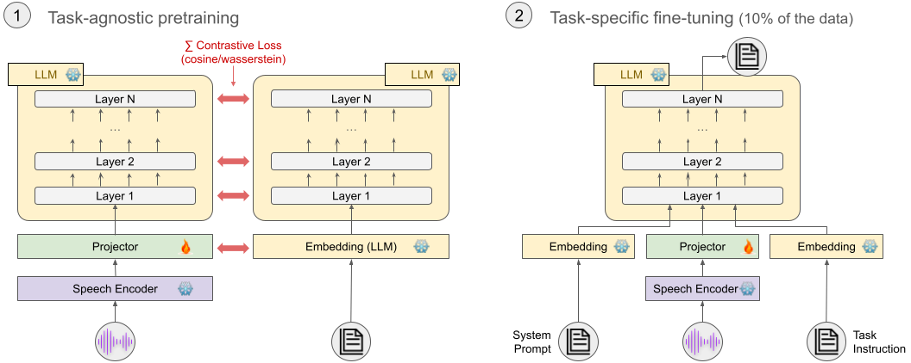

# Contrastive Learning for Task-Independent SpeechLLM-Pretraining

<a href='http://arxiv.org/abs/2412.15712'> </a>

Large language models (LLMs) excel in natural language processing but adapting these LLMs to speech processing tasks efficiently is not straightforward. Direct task-specific fine-tuning is limited by overfitting risks, data requirements, and computational costs. To address these challenges, we propose a scalable, two-stage training approach: (1) A task-independent speech pretraining stage using contrastive learning to align text and speech representations over all layers, followed by (2) a task-specific fine-tuning stage requiring minimal data. This approach outperforms traditional ASR pretraining and enables the model to surpass models specialized on speech translation and question answering while being trained on only 10% of the task-specific data.

An overview of our approach can be seen below.



This repository contains the code used for this project. The codebase started as a fork of [LLaVA](https://github.com/haotian-liu/LLaVA). Please see [here](https://github.com/haotian-liu/LLaVA) for the main contributers. The codebase was further developed by the [meetween team](https://www.meetween.eu/about/).


## Contents
- [Install](#install)
- [Data](#data)
- [Codebase](#codebase)

## Install
1. Clone this repository and navigate to the contr-pretraining folder
```bash
git clone 
cd contr-pretraining
```

2. Install Dependencies
```Shell
conda create -n llava-contr python=3.10 -y
conda activate llava-contr
pip install --upgrade pip  # enable PEP 660 support
pip install -e .
pip install flash-attn==2.5.9.post1 --no-build-isolation # install flash-attn
```

## Data
We use different datasets in this project, listed below. 
- [MustC-v1](https://aclanthology.org/N19-1202/)
- [SpokenSquad](https://arxiv.org/abs/1804.00320)
- [GigaSpeech](https://arxiv.org/abs/2106.06909)
- [mls-english-speaker-dataset](https://huggingface.co/datasets/parler-tts/mls-eng-speaker-descriptions) 

Our code expects these datasets to be in parquet format. The data is then loaded with [llava/dataset/custom_dataset](llava/dataset/custom_dataset). The data path, where the data is stored, needs to be added to [scripts/data_configs](scripts/data_configs).

## Codebase


### Training Scripts
Example pretraining and finetuning scripts can be found in [scripts/pretrain](scripts/pretrain) and [scripts/finetune](scripts/finetune).
They can be launched with 
```Shell
bash scripts/pretrain/example_script.sh
```

### Inference Scripts
For inference, please run the following command:
```Shell
python llava/eval/eval.py \
                --model-path path-to-your-model-folder \
                --dataset  path-to-the-data-config/config.yml \ # examples in llava/eval/data_configs
                --data-dir data-path \
                --results-dir results-directory-path \
                --batch-size 2 \ # change to your needs
                --tokenizer-padding-side left \
                --from-yml 
```

### The model
Our model uses a [HuBERT](https://ieeexplore.ieee.org/document/9585401) encoder, a [Q-Former](https://www.semanticscholar.org/paper/BLIP-2%3A-Bootstrapping-Language-Image-Pre-training-Li-Li/3f5b31c4f7350dc88002c121aecbdc82f86eb5bb) projector and [Llama-3.1-8B-instruct](https://huggingface.co/meta-llama/Llama-3.1-8B-Instruct). However, in this work, we only train the projector, and consequently only the projector gets saved after training.

The checkpoint folder name should start with `llava-`. Otherwise, it can't be loaded correctly. This is a behaviour from the original LLaVA codebase.

### Mixed-Speech-Text Inputs
To obtain mixed-speech-text inputs, one needs to run the asr-pretrainig script and add the `--audio_nwp` flag. This will then create the mixed speech-text-input data, without starting the training. The training can be started with [scripts/pretrain/pretrain-mixed-nwp.sh](scripts/pretrain/pretrain-mixed-nwp.sh), after the data has been created.

